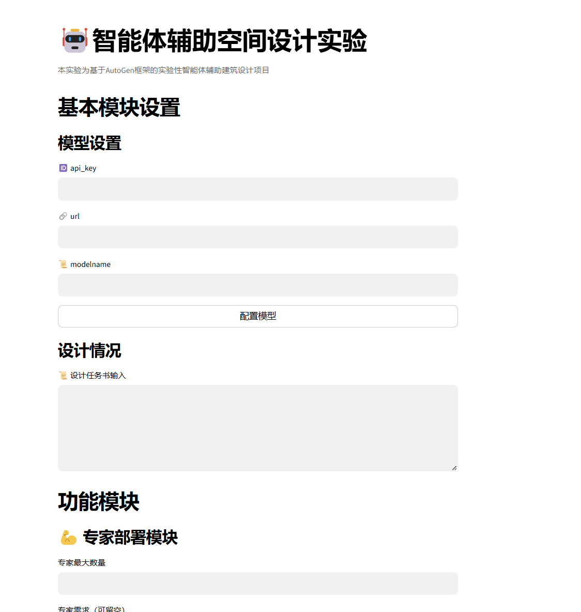

# Pipeline Design of AI Agent in Urban Public Space Design Assistance
# 面向城市公共空间营造辅助的大模型智能体研究

This project is an attempt to apply artificial intelligence entities in the field of architecture, primarily focusing on optimizing and adjusting the early stages of design inference and processes. The project is divided into three distinct modules, namely the User Research Module, Expert Deployment Module, and Design Consultation Module, with the first two serving to assist the third module through the establishment of different agents. In testing, due to the need for sketching and image recognition functions, all intelligent entity tools and large models are based on OpenAI's GPT-4 related tools (GPT-4V, Dalle sketching tool), with other API supports not yet tested. Specific applications can be seen in the AutoGenTest.ipynb notebook

本项目为建筑领域中人工智能体的应用尝试，主要针对前期的设计推断和流程进行优化和调整。本项目主要针对城市公共空间设计过程中可能遇到的问题提出，项目分为三个不同的模块，分别为用户研究模块，专家部署模块和设计咨询模块，前两者均为建立不同的Agent辅助第三个模块使用。在测试中，由于需要用到生图和识图功能，所有的智能体工具大模型均基于OpenAI的GPT4相关工具（GPT4V,Dalle生图工具）使用，其余API支持暂时没有测试。具体应用可见AutoGenTest.ipynb notebook.

## Keyword
Computer Aid Design, Design Assistant Tool, AI Agent

## Requirement
1. autogenstudio  0.0.47
2. pyautogen 0.2.22 https://github.com/microsoft/autogen
3. python 3.11.8

如果需要运行app界面，在端口通过命令`streamlit run {path to AppTest.py}` 运行
